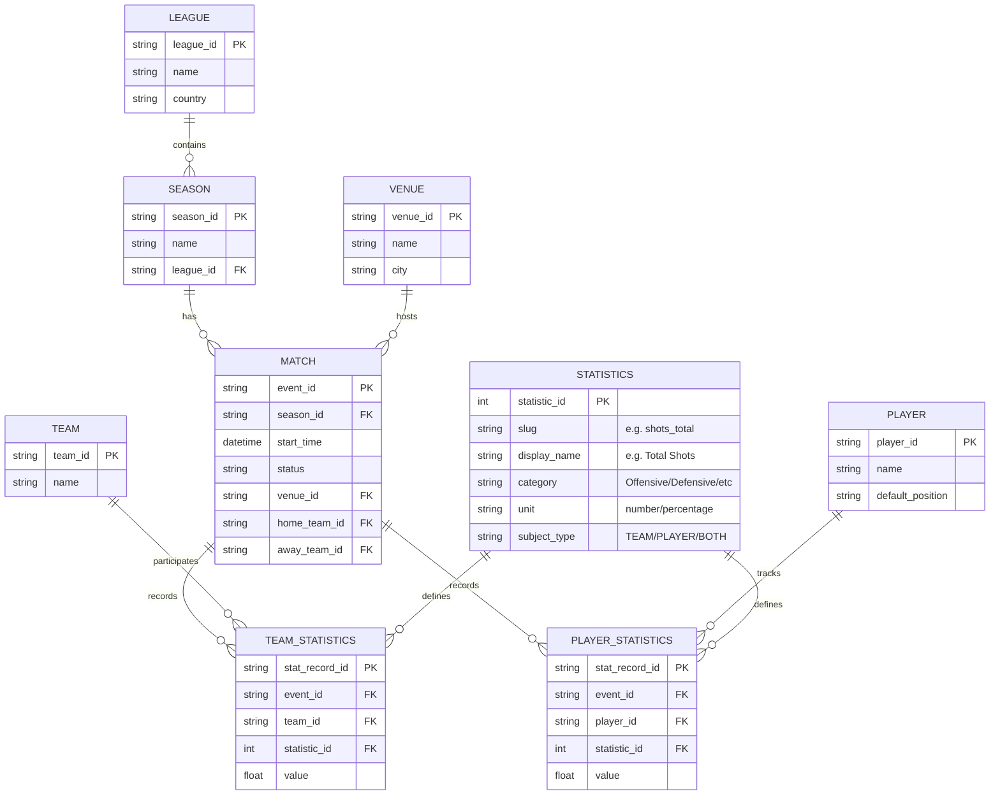

# Proyecto SGBD - Grupo 2

## Modelo Entidad-Relación (ER)

Este documento detalla el diseño de la base de datos para el proyecto de la materia SGBD. Siguiendo principios avanzados de diseño de bases de datos.

### Diagrama Mermaid

### Arquitectura del Modelo Refinado

1.  **Flexibilidad Dinámica (EAV Pattern)**:
    *   En lugar de añadir columnas nuevas cada vez que Sportradar actualiza su API (ej. `xG`, `expected_assists`), simplemente insertamos una nueva fila en `STATISTICS`.
    *   Este enfoque resuelve el problema de columnas vacías: si una estadística solo aplica a jugadores (ej. `assists`), solo habrá registros correspondientes en `PLAYER_STATISTICS` vinculado a ese ID de estadística.

2.  **Normalización de Alto Nivel**:
    *   Separamos la definición de la métrica (`STATISTICS`) de su valor transaccional.
    *   Se mantienen tablas de "Hechos" separadas para Equipos y Jugadores para optimizar índices y particionamiento, manteniendo la integridad referencial.

3.  **Análisis y BI**:
    *   Para reconstruir la vista plana (DataFrames actuales), se utilizan consultas de agregación o operadores `PIVOT`.
    *   Este modelo es ideal para análisis históricos donde la disponibilidad de ciertas métricas varía entre temporadas.

4.  **Integridad**:
    *   `TEAM_STATISTICS` y `PLAYER_STATISTICS` actúan como registros granulares de cada evento, permitiendo auditorías completas de la data procesada.

### Selección de Tecnología y Justificación Técnica

Como equipo de este Master, hemos evaluado distintas alternativas para el almacenamiento y gestión de nuestro dataset. Basándonos en los requisitos de integridad deportiva y la naturaleza de las estadísticas de Sportradar, hemos seleccionado **PostgreSQL** como nuestro sistema de gestión de base de datos (SGBD) principal.

#### 1. Justificación del Modelado y Adecuación a Consultas
Hemos optado por un híbrido entre un esquema Relacional y un patrón **EAV (Entity-Attribute-Value)** mediante la tabla `STATISTICS`. Esta elección se justifica por la alta variabilidad de las métricas de la API (más de 40 indicadores que cambian según el tipo de partido o proveedor). 
- **Patrón de Operación**: Este modelo permite realizar agregaciones complejas (ej. promedios de posesión por temporada) mediante JOINs indexados, optimizando los tiempos de respuesta para nuestro Dashboard.
- **Flexibilidad**: El uso del catálogo de estadísticas evita las tablas dispersas (con excesivos NULLs), permitiendo que el esquema sea "denso" y eficiente a nivel de almacenamiento.

#### 2. Integridad y Consistencia de Datos
En un entorno de Big Data deportivo, la veracidad es crítica. PostgreSQL nos ofrece:
- **ACID Compliance**: Garantiza que las estadísticas de un partido se carguen de forma atómica.
- **Foreign Keys**: Aseguramos que no existan estadísticas huérfanas sin un partido o equipo válido según el catálogo.

#### 3. Evolución del Esquema y Escalabilidad
- **Esquema Dinámico**: Al utilizar la tabla `STATISTICS`, si en el futuro decidimos incorporar métricas avanzadas como *Expected Goals (xG)* o *Heatmaps*, no necesitamos alterar la estructura física de las tablas de producción (sin comandos `ALTER TABLE`), lo que garantiza tiempo de inactividad cero.
- **Escalabilidad**: PostgreSQL permite el particionamiento de tablas por `event_id` o `season_id`, lo que facilita el manejo de volúmenes crecientes de datos históricos conforme avancen las temporadas de La Liga.

#### 4. Mantenibilidad y Viabilidad Local
- **Operación**: Es una tecnología estándar en la industria con una curva de aprendizaje equilibrada para perfiles de ingeniería de datos.
- **Ejecución Local**: Es ideal para este trabajo ya que puede ejecutarse mediante contenedores (Docker) o instalación nativa en cualquier SO sin depender de nubes propietarias, cumpliendo con el requisito de ser un entorno totalmente reproducible y sin dependencias externas obligatorias para la validación del proyecto.

---
*Diseño y justificación técnica desarrollados por el Grupo 2*
