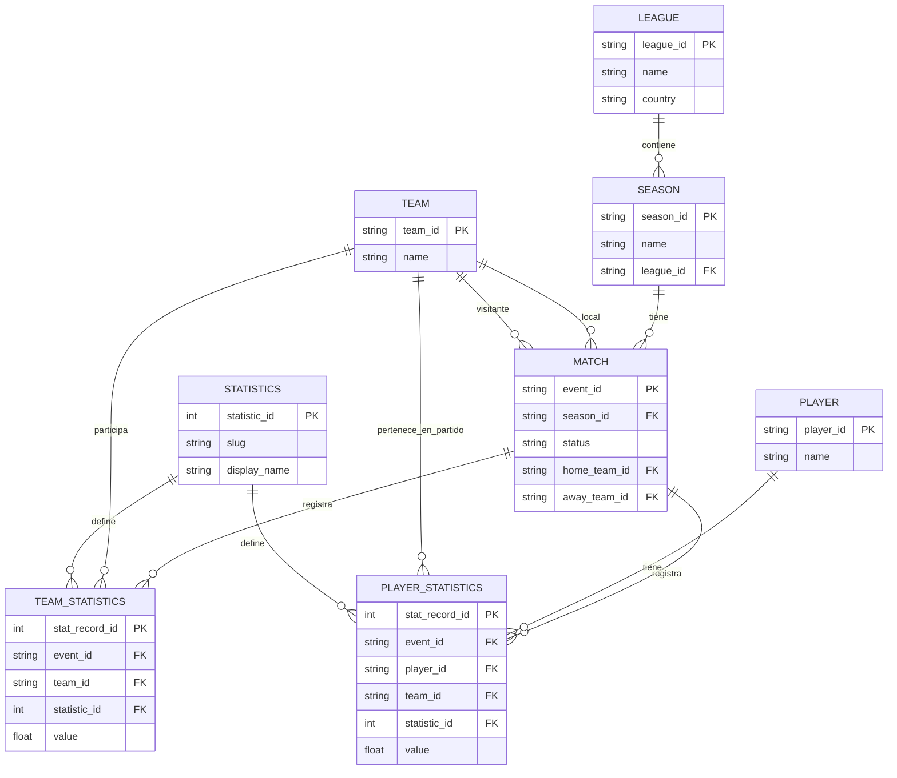

# Proyecto SGBD - Grupo 2

## 🚀 Cómo correr el proyecto

### Requisitos previos
- **Docker** y **Docker Compose** instalados.
- Los archivos CSV del dataset en la carpeta `dataset/`.

### Levantar el entorno y ver los logs de carga

```bash
docker-compose up -d --build && docker-compose logs -f loader
```

Este único comando:
1. Construye las imágenes necesarias.
2. Levanta el contenedor de **PostgreSQL** y crea el esquema definido en `database/init.sql`.
3. Lanza el contenedor **loader** que procesa los CSV e inserta los datos en el modelo normalizado.
4. Muestra en tiempo real el progreso de la carga.

> [!NOTE]
> La carga puede tardar varios minutos, especialmente la inserción de `player_statistics`, que contiene **más de un millón de registros**. Espera aproximadamente **~5 minutos** hasta que el loader finalice.

### Credenciales de conexión

Una vez finalizada la carga, la base de datos está disponible en:

| Parámetro  | Valor            |
|------------|------------------|
| Host       | `localhost`      |
| Port       | `5432`           |
| Database   | `soccer_stats`   |
| User       | `user_master`    |
| Password   | `password_master`|

### Verificar la carga

```sql
SELECT COUNT(*) FROM player_statistics;
```

---

## 📐 Modelo Entidad-Relación

El diagrama completo y la justificación de diseño está en [`docs/modeling.md`](docs/modeling.md).



---

## Arquitectura del Modelo

### Flexibilidad Dinámica (EAV Pattern)
En lugar de añadir columnas nuevas cada vez que la API evoluciona (ej. `xG`, `expected_assists`), el modelo usa la tabla `STATISTICS` como catálogo. Esto evita columnas vacías y permite extender el esquema sin `ALTER TABLE`.

### Normalización y Granularidad
Separación clara entre datos maestros (dimensiones) y hechos transaccionales. Las tablas de estadísticas están separadas por sujeto (Team vs Player) para optimizar el indexado en consultas masivas.

`PLAYER_STATISTICS` incluye `team_id` para saber a qué equipo pertenecía el jugador en ese partido (un jugador puede cambiar de equipo entre temporadas).

### Pipeline de Ingesta (ETL)
El loader automatizado:
1. **Valida** la disponibilidad del SGBD antes de iniciar.
2. **Transforma** los DataFrames anchos (CSV) a formato largo compatible con el modelo EAV.
3. **Carga atómicamente** las dimensiones maestras primero y luego los hechos, preservando la integridad referencial.
4. **Es idempotente**: se puede ejecutar varias veces sin duplicar registros (`ON CONFLICT DO NOTHING`).

### Selección de Tecnología: PostgreSQL
- **Integridad**: ACID completo garantizando cargas atómicas por partido.
- **Escalabilidad**: Indexación GIN/B-Tree y particionamiento nativo.
- **Esquema dinámico**: Nuevas métricas = nueva fila en `STATISTICS`, sin tocar la estructura física.
- **Viabilidad local**: Contenedorizado con Docker, sin dependencias externas.

---

## � Documentación técnica completa

Para la justificación de diseño detallada consulta [`docs/modeling.md`](docs/modeling.md).

---
*Master en Big Data & Business Intelligence — Grupo 2*
