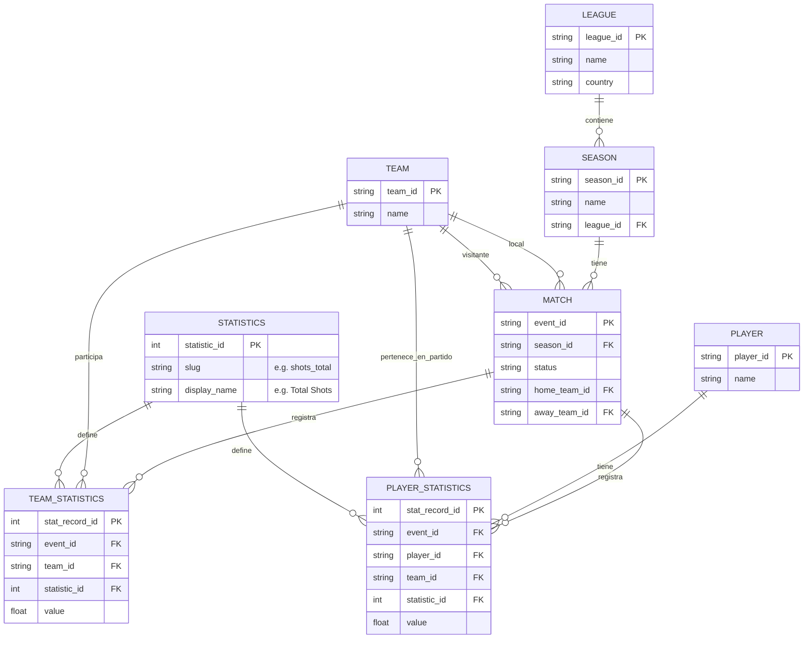

# Documentación de Modelado de Datos - Grupo 2

Este documento detalla el diseño de la base de datos para el proyecto de la materia SGBD. Siguiendo principios avanzados de diseño de bases de datos para Big Data.

## 1. Modelo Entidad-Relación (ER)

### Diagrama

## 2. Arquitectura del Modelo y Justificación

### Flexibilidad Dinámica (EAV Pattern)
En lugar de añadir columnas nuevas cada vez que las APIs evolucionan (ej. xG, expected assists), el modelo utiliza la tabla `STATISTICS` como catálogo. Este enfoque resuelve el problema de columnas vacías y permite que el esquema sea extensible sin modificar la estructura física de las tablas.

### Normalización y Granularidad
Se ha aplicado una normalización de alto nivel para separar datos maestros de hechos transaccionales. Las tablas de "Performance" están separadas por sujeto (Team vs Player) para optimizar el particionamiento e indexación en consultas masivas.

`PLAYER_STATISTICS` incluye `team_id` para saber a qué equipo pertenecía el jugador en el contexto de ese partido (ya que un jugador puede cambiar de equipo entre temporadas).

### Selección de Tecnología: PostgreSQL
Hemos seleccionado **PostgreSQL** basándonos en los siguientes pilares de nuestro Master:
- **Integridad Deportiva**: Soporte total de ACID para garantizar que las cargas de partidos sean atómicas y consistentes.
- **Evolución del Esquema**: Facilidad para manejar el catálogo de estadísticas dinámicas.
- **Escalabilidad**: Capacidades de indexación GIN/B-Tree y particionamiento nativo.
- **Viabilidad Local**: Contenerización sencilla para entornos de desarrollo y evaluación.

### Pipeline de Ingesta (ETL)
Para la carga de los datos históricos de Sportradar, hemos implementado una capa de **Loader** automatizada que:
1.  **Validación**: Verifica la preparación del SGBD antes de iniciar la ingesta.
2.  **Transformación**: Realiza un "melting" de los DataFrames anchos (CSV) a un formato largo compatible con el modelo EAV.
3.  **Carga Atómica**: Inserta las dimensiones maestras (Leagues, Teams, Players) seguidas de los hechos (Statistics) preservando la integridad referencial.
4.  **Idempotencia**: Diseñado para ser ejecutado múltiples veces sin duplicar registros, facilitando procesos de recuperación ante desastres (DR) y actualizaciones parciales.

---
*Documentación técnica - Master en Big Data & Business Intelligence*
